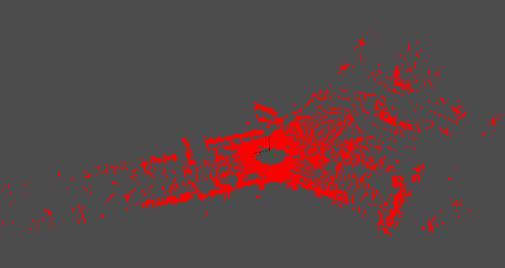
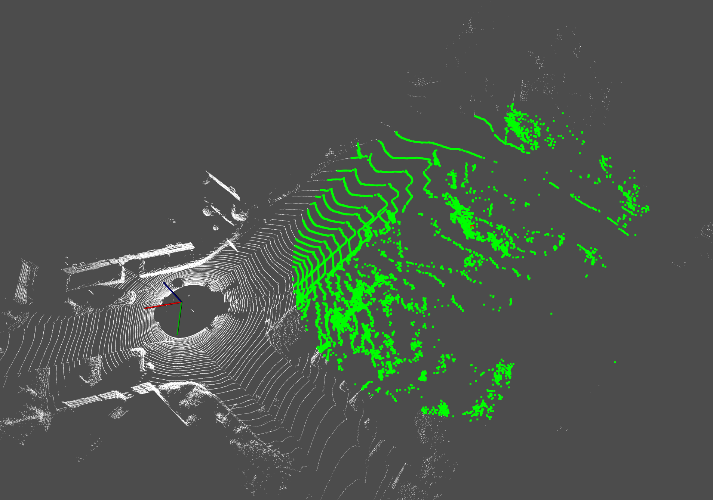
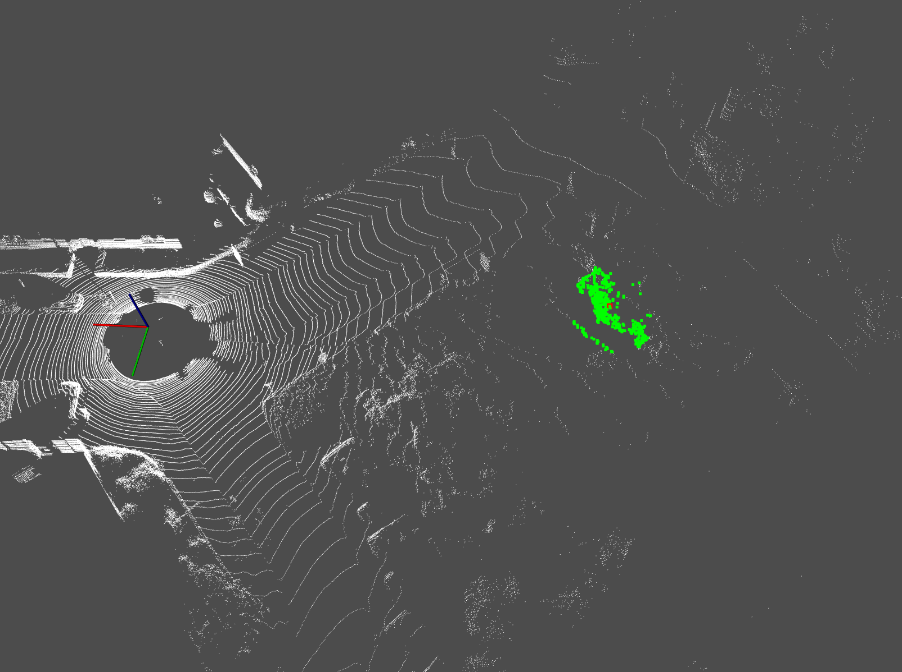
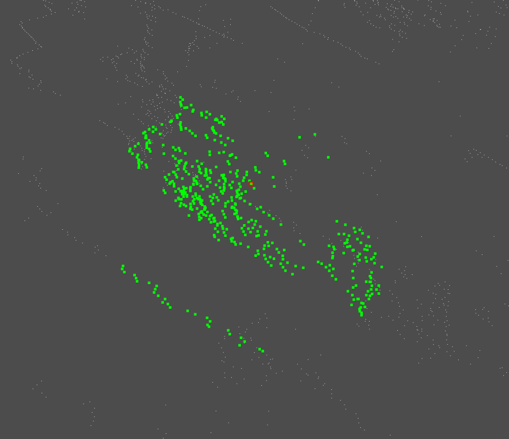

## 0. 作业代码的执行方法

①首先安装依赖库，`Eigen`和`PCL`

②然后进行编译

```shell
cd lecture_2
mkdir build
cd build
cmake ..
make -j4
```

③运行

```shell
cd build
./kdtree_app #kdtree的作业
```

> 以下所有代码都是采用的C++编写，运行的系统是Ubuntu18.04，PCL版本是1.8，矩阵运算的库是Eigen

## 1. 读取点云数据

作业中提供的点云数据是bin文件格式，所以首先需要将bin文件格式读取并转换为pcl的点云格式：

```cpp
bool ReadData::Read(const std::string &point_file_path, PointCloudPtr& point_cloud_ptr) {
    FILE *stream;

    int32_t num = 1000000;
    float* data = (float *) malloc(num*sizeof(float));

    float *x_ptr = data + 0;
    float *y_ptr = data + 1;
    float *z_ptr = data + 2;
    float *i_ptr = data + 3;

    stream = fopen(point_file_path.c_str(), "rb");
    num = fread(data, sizeof(float), num, stream) / 4;
    for (int32_t i = 0; i < num; ++i) {
        Point point;
        point.x = *x_ptr;
        point.y = *y_ptr;
        point.z = *z_ptr;
        point.intensity = *i_ptr;

        point_cloud_ptr->push_back(point);

        x_ptr += 4;
        y_ptr += 4;
        z_ptr += 4;
        i_ptr += 4;
    }

    fclose(stream);
    free(data);

    std::cout << "totally read points: " << point_cloud_ptr->size() << std::endl;

    return true;
}
```

读取的bin文件，通过pcl可以显示功能，可以看到最终的效果如下：显示部分对应的代码[参考这里](https://github.com/zm0612/3d-pointclouds/blob/447e00cef8fd8601cca31c6b825b5cc0745d3dc6/lecture_2/src/pcl_viewer.cpp#L6)



## 2. 构建kdtree

构建kdtree根据课程中的介绍，使用的递归的方式实现了kdtree的建立，部分建树的代码如下：[完整代码点这里](https://github.com/zm0612/3d-pointclouds/blob/447e00cef8fd8601cca31c6b825b5cc0745d3dc6/lecture_2/src/kdtree.cpp#L22)

```cpp
KDTree::Node *KDTree::KDTreeRecursiveBuild(Node *&root, const PointCloudPtr &point_cloud_ptr,
                                           const std::vector<unsigned int> &point_indices, AXIS axis,
                                           unsigned int leaf_size) {
    if (root == nullptr) {
        Node* left_node = nullptr, *right_node = nullptr;
        Node *node = new Node(axis, std::numeric_limits<float>::min(), left_node, right_node, point_indices);
        root = node;
    }

    if (point_indices.size() > leaf_size) {
        std::vector<unsigned int> sorted_indices = SortKeyByValue(point_indices, point_cloud_ptr, axis);

        unsigned int middle_left_idx = std::ceil(sorted_indices.size() / 2.0) - 1u;
        unsigned int middle_left_point_idx = sorted_indices[middle_left_idx];
        float middle_left_point_value = 0.0f;

        unsigned int middle_right_idx = middle_left_idx + 1;
        unsigned int middle_right_point_idx = sorted_indices[middle_right_idx];
        float middle_right_point_value = 0.0f;

        switch (axis) {
            case AXIS::X:
                middle_left_point_value = point_cloud_ptr->at(middle_left_point_idx).x;
                middle_right_point_value = point_cloud_ptr->at(middle_right_point_idx).x;
                break;
            case AXIS::Y:
                middle_left_point_value = point_cloud_ptr->at(middle_left_point_idx).y;
                middle_right_point_value = point_cloud_ptr->at(middle_right_point_idx).y;
                break;
            case AXIS::Z:
                middle_left_point_value = point_cloud_ptr->at(middle_left_point_idx).z;
                middle_right_point_value = point_cloud_ptr->at(middle_right_point_idx).z;
                break;
        }

        root->value_ = (middle_right_point_value + middle_left_point_value) * 0.5f;

        std::vector<unsigned int> sorted_indices_left(sorted_indices.begin(), sorted_indices.begin() + middle_right_idx);
        root->left_ptr_ = KDTreeRecursiveBuild(root->left_ptr_, point_cloud_ptr,
                                               sorted_indices_left, AxisRoundRobin(axis),
                                               leaf_size);

        std::vector<unsigned int> sorted_indices_right(sorted_indices.begin() + middle_right_idx, sorted_indices.end());
        root->right_ptr_ = KDTreeRecursiveBuild(root->right_ptr_, point_cloud_ptr,
                                                sorted_indices_right, AxisRoundRobin(axis),
                                                leaf_size);
    }

    return root;
}
```

通过运行上面的代码发现在`Release`版本下，对124668个3D点建立kdtree共计用时__112.17ms__

## 3. KNN搜索

建立Kdtree之后，按照课程中的思路对算法进行了实现。

首先，定义KNN搜索结果的类，用于保存每次搜索得到的距离、索引等结果。[完整代码](https://github.com/zm0612/3d-pointclouds/blob/f0b60b172a2eaf513448e29be5e2a5cb63d23e1c/lecture_2/include/knn_result_set.h#L25)

然后定义kdtree的每个节点为一个结构体，其代码形式如下：

```cpp
    struct Node{
        Node(AXIS axis, double value, Node*& left, Node*& right,
             const std::vector<unsigned int>& point_indices)
             : axis_(axis), value_(value), left_ptr_(left)
             , right_ptr_(right), point_indices_(point_indices){}

        AXIS axis_;
        float value_ = std::numeric_limits<float>::max();
        Node* left_ptr_ = nullptr;
        Node* right_ptr_ = nullptr;
        std::vector<unsigned int> point_indices_;

        bool IsLeaf() const{
            return value_ == std::numeric_limits<float>::min();
        }
    };
```

kdtree的搜索采用的也是递归的思路，其流程与课程中讲述的流程一致。[完整代码](https://github.com/zm0612/3d-pointclouds/blob/f0b60b172a2eaf513448e29be5e2a5cb63d23e1c/lecture_2/src/kdtree.cpp#L115)

对kdtree执行knn搜索，对于124668个3D点，一次1nn搜索所用时间为：__0.010616ms__

为了对比搜索次数增加对于时间的影响，我对于同一个点，分别搜索的它的1、10、100、1000、10000近邻，分别获得时间如下：

| 1NN        | 10NN       | 100NN      | 1000NN    | 10000NN   |
| ---------- | ---------- | ---------- | --------- | --------- |
| 0.010616ms | 0.025212ms | 0.141286ms | 1.54751ms | 72.1013ms |

可以发现当对一个点，执行近邻搜索时，如果想要获得的近邻点非常多时，kdtree的效率就变低了，其主要原因时，当想要获得更多的点时，需要遍历的节点就会更多，这其中会增加很多重复的操作。

以下展示一个10000近邻的搜索结果，说明了本代码kdtree搜索的正确性。



## 4.暴力搜索

为了与kdtree的结果形成对比，本文还实现了一个暴力搜索算法，与纯粹的暴力搜索相比，本算法构造了一个队列，用于存储最近邻点，所以不论想要获得多少个最近邻点，只要遍历一次点云就可以获得。其代码如下：

```cpp
std::vector<std::pair<unsigned int, float>> BruteForceSearch::QueryPoints(const Eigen::Vector3f& query_point,
                                                                          const unsigned int capacity) {
    float worst_dist = std::numeric_limits<float>::max();
    unsigned int count = 0;
    std::vector<std::pair<unsigned int, float>> result(capacity);
    for (unsigned int i = 0; i < capacity; ++i) {
        result[i] = (std::pair<unsigned int, float>(0, std::numeric_limits<float>::max()));
    }

    for (unsigned int i = 0; i < point_cloud_ptr_->size(); ++i) {
        Point point = point_cloud_ptr_->at(i);
        Eigen::Vector3f point_eigen;
        point_eigen.x() = point.x;
        point_eigen.y() = point.y;
        point_eigen.z() = point.z;

        float dist = (point_eigen - query_point).norm();

        if (dist > worst_dist){
            continue;
        }

        if (count < capacity){
            count++;
        }

        unsigned int temp = count - 1;

        while (temp > (unsigned int)0){
            if (result[temp-1].second > dist){
                result[temp] = result[temp-1];
                --temp;
            } else{
                break;
            }
        }

        result[temp].second = dist;
        result[temp].first = i;
        worst_dist = result[capacity-1].second;
    }

    return result;
}
```

其效果如下图，演示了暴力匹配下的500近邻搜索结果：





## 5.暴力搜索对比kdtree

同样的为了对比kdtree，这里分别计算1、10、100、1000、10000近邻暴力搜索用时：

暴力搜索

| 1NN         | 10NN       | 100NN       | 1000NN     | 10000NN    |
| ----------- | ---------- | ----------- | ---------- | ---------- |
| 0.256241 ms | 0.30478 ms | 0.724934 ms | 1.52537 ms | 65.3596 ms |

kdtree

| 1NN        | 10NN       | 100NN      | 1000NN    | 10000NN   |
| ---------- | ---------- | ---------- | --------- | --------- |
| 0.010616ms | 0.025212ms | 0.141286ms | 1.54751ms | 72.1013ms |

可以看到在1NN的情况下，kdtree方法比暴力搜索快了__24__倍，但是随着近邻点数的增加，kdtree的搜索时间增长的比较快，当1000近邻时，kdtree的knn速度已经略低于暴力搜索。

__结论__：对于近邻搜索，如果是单点的少数近邻搜索，可以选用kdtree，例如法向量的求解，但是当进行大数量的近邻搜索时，kdtree并不占优势，而且kdtree建树也会消耗很多时间。

