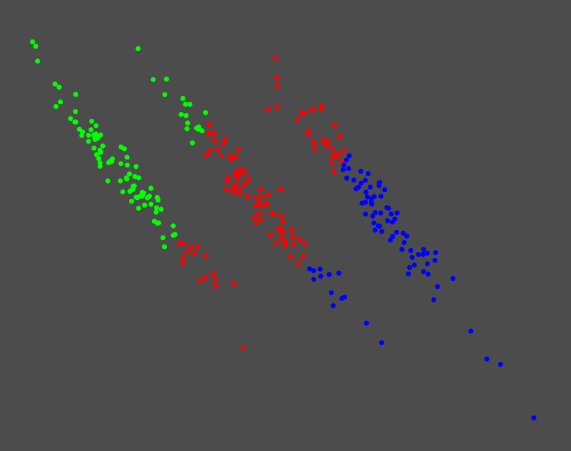
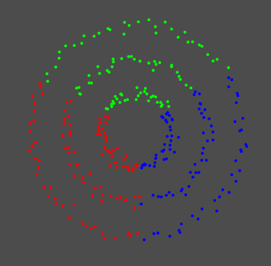
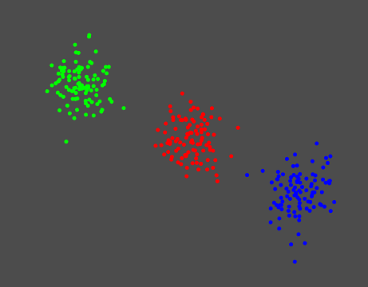
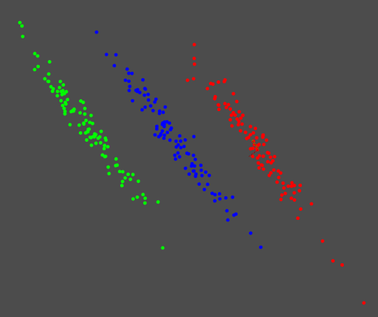
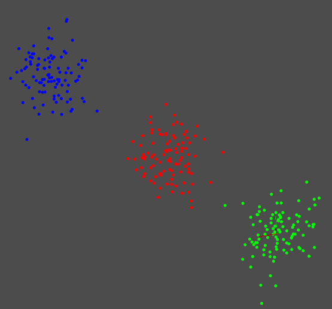
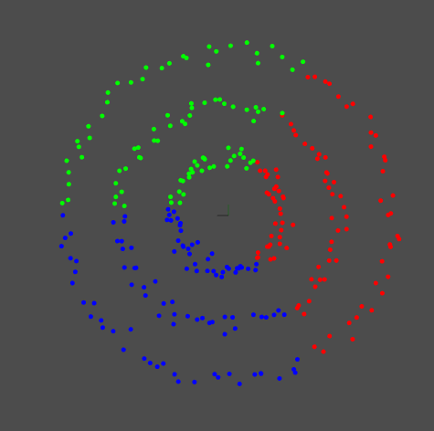
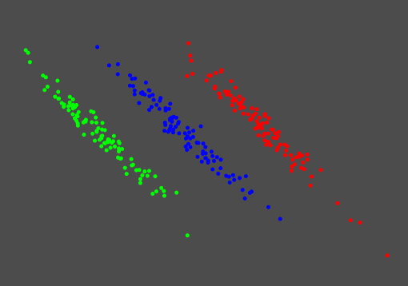
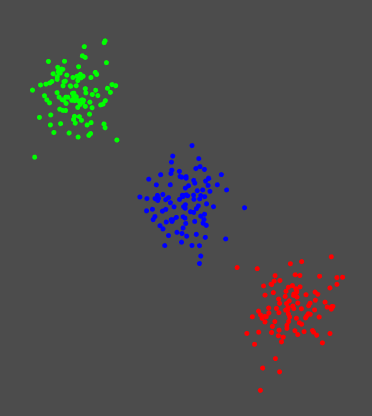
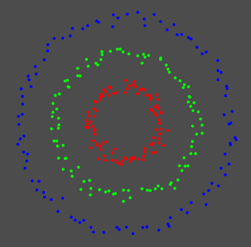

# 1. 实验结果

## a. kmeans

时间：0.198 msec

时间：0.245 msec

时间：0.19 msec

## b. GMM

时间：2.89 msec

时间：3.03 msec

时间：17 msec

## c. Spectral clustering

时间：92.1 msec

时间：89.5 msec

时间：113 msec

#  2.结论

实验结果与论文中给出的结果是一致的。但是我在实现这些代码时，没有更进一步细致的去调，所以有些地方还存在不稳定，对于kmeans由于是随机选择初始中心，所以它的稳定性有一些小问题，这一点在谱聚类中有显现，所以谱聚类不是很稳定，如果换成kmeans++，这个问题应该会消除。

另外，实验发现谱聚类对于权重的计算公式有一定的依赖性，而且归一化的$L$和为归一化的对结果也会产生很大的影响，如果后续需要继续研究谱聚类可以针对这个进行优化。

