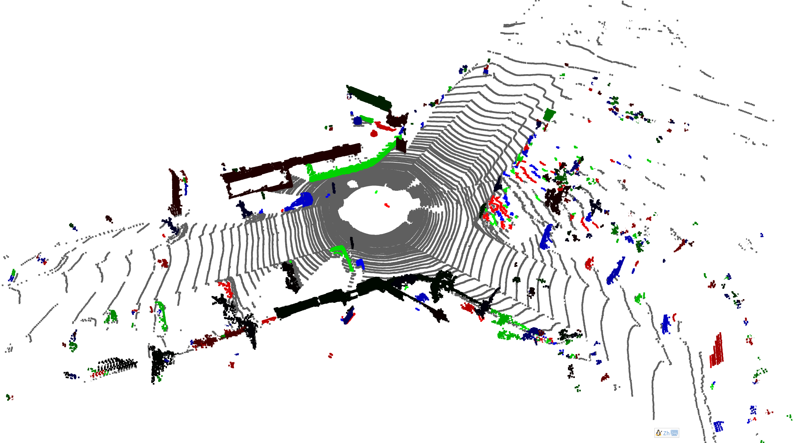
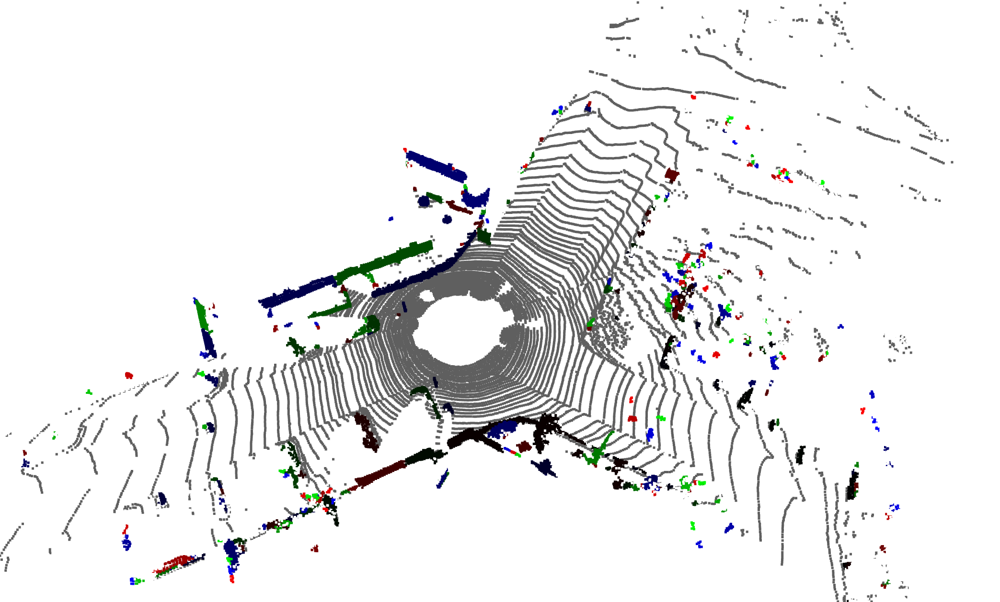

#　第四章作业解答

## 1. 题目要求

使用kitti数据集中的点云数据，完成地面点云分割与剩余点云聚类

## 2. 解答

### a. 地面点云分割

对于地面点云的分割，采用的是`python-pcl`库中的抽样一致性算法，通过RANSAC方式的平面拟合，获得地面点云。

在进行地面点云分割之前，先做一步数据预处理，目的是为了先大致提取出地面点云，为了后面的RANSAC能收敛的更快。数据预处理方法思路是，对点云计算法向量，地面点云的法向量与Z轴的夹角较小，通过这个方法可以去掉大量的与地面无关的点云。

数据预处理的代码如下：

```python
pcd_original = o3d.geometry.PointCloud()
    pcd_original.points = o3d.utility.Vector3dVector(data)
    pcd_original.estimate_normals(
        search_param=o3d.geometry.KDTreeSearchParamHybrid(
            radius=5.0, max_nn=9
        )
    )
    normals = np.asarray(pcd_original.normals)
    angular_distance_to_z = np.abs(normals[:, 2])
    idx_downsampled = angular_distance_to_z > np.cos(np.pi / 8)
    downsampled = data[idx_downsampled]
```

地面点云分割的代码如下：

```python
class GroundSegmenter():
    def __init__(self, cloud, max_distance=0.30):
        self.__max_distance = max_distance
        self.__segmenter = cloud.make_segmenter()
        self.__segmenter.set_model_type(pcl.SACMODEL_PLANE)
        self.__segmenter.set_method_type(pcl.SAC_RANSAC)
        self.__segmenter.set_distance_threshold(self.__max_distance)
        self.__segmenter.set_optimize_coefficients(True)

    def get_max_distance(self):
        return self.__max_distance

    def segment(self):
        return self.__segmenter.segment()
```

分割之后发现，`pcl`库`segment()`函数的返回值中，第一个参数（inliers）似乎有一些问题，不知道啥原因，由于刚学python。

所以将第二个参数，平面参数拿出来，重新对所有点计算点到平面的距离，阈值之内的点均为地面点，代码如下：

```python
distance_to_ground = np.abs(
        np.dot(data, np.asarray(model[:3])) + model[3]
    )

    idx_ground = distance_to_ground <= ground_segmenter.get_max_distance()
    idx_segmented = np.logical_not(idx_ground)
    segmented_cloud = data[idx_segmented]
    segmented_ground = data[idx_ground]
```

### b. 点云聚类

去除地面点云之后，对剩下的点云执行聚类，采用`sklearn`中的`DBSAN`算法，代码如下：

```python
def clustering(data):
    cluster_index = DBSCAN(
        eps=0.25, min_samples=5, n_jobs=-1
    ).fit_predict(data)

    return cluster_index
```

获得聚类之后的结果如下：



用时：

- 地面点云去除：0.1357s
- 聚类点云用时：0.2939s


通过实验发现，对点云进行一步提速滤波处理，可以大幅度提高后续点云聚类以及地面去除的速度，但是对于效果并没有明显的降低：



用时：

- 地面点云去除：0.0446s
- 聚类点云用时：0.1232s