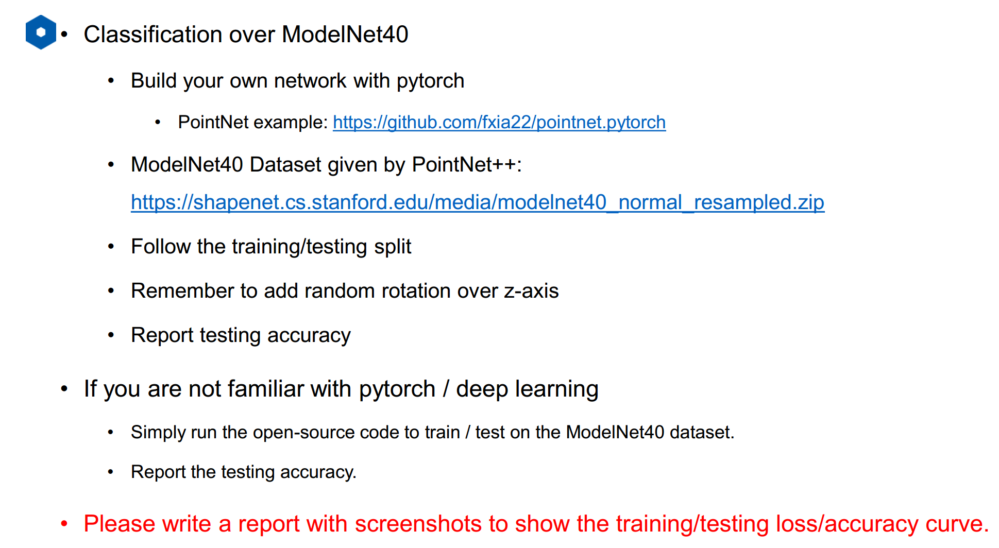
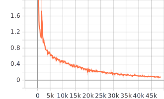
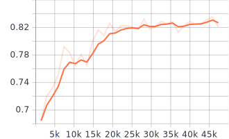

## 1.作业要求




## 2.解答过程

代码使用的是课程中提供的框架，然后将缺失的部分补充完整。

### 2.1 PointNet model

对于model文件重点的PointNet网络中的forward函数，其补充完整之后的形式如下：

```python
    def forward(self, x):
        # TODO: use functions in __init__ to build network
        x = self.relu(self.bn1(self.conv1(x)))
        x = self.relu(self.bn2(self.conv2(x)))
        x = self.relu(self.bn3(self.conv3(x)))
        x = torch.max(x, 2, keepdim=True)[0]
        x = x.view(-1, 1024)

        x = self.relu(self.bn4(self.fc1(x)))
        x = self.relu(self.bn5(self.dropout(self.fc2(x))))
        x = self.fc3(x)
        x = F.log_softmax(x, dim=1)

        return x
```

> 将输入结果y转化为softmax函数值，目的是score转换成概率

### 2.2 对数据进行归一化和旋转

对应`dataset.py`文件，其中需要对数据进行归一化和旋转，以增加网络的稳定性和泛化能力。其代码分别如下：

__归一化__

```python
feature = feature - np.expand_dims(np.mean(feature, axis=0), 0)
dist = np.max(np.sqrt(np.sum(feature ** 2, axis=1)), 0)
feature = feature / dist
```

__旋转__

```python
theta = np.random.uniform(0, np.pi * 2)
 rotation_matrix = np.array([[np.cos(theta), -np.sin(theta)], [np.sin(theta), np.cos(theta)]])
 feature[:, [0, 2]] = feature[:, [0, 2]].dot(rotation_matrix)  # rotate x and y
```

> 对于点云的旋转，只针对其x和y坐标，相当于对yaw角进行旋转

### 2.3  计算loss

对于loss使用交叉熵，其定义方法如下：

```python
def softXEnt(prediction, real_class):
    # TODO: return loss here
    cross_entropy_loss = torch.nn.CrossEntropyLoss()
    target = torch.argmax(real_class, axis=1)
    loss = cross_entropy_loss(prediction, target)
    return loss
```

> 其余一些函数的实现，可以之间参考代码！


## 3. 训练和测试

### 3.1 下载数据集

首先通过一下链接下载ModelNet40数据集：

```html
https://shapenet.cs.stanford.edu/media/modelnet40_normal_resampled.zip
```

将下载下来的数据集解压之后，复制到工作目录的下的`/dataset`目录

### 3.2 训练

```python
python3 train.py
```

### 3.3 测试

```python
python3 test.py
```


## 4. 实验结果

training_acc：



validing_acc:



最终的测试精度，通过对最终的所有测试数据进行测试，发现pointnet的精度可以达到：__0.833__

