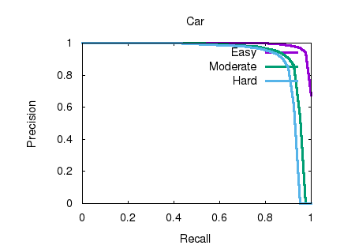

# 第六章 作业

## 1. 计算voxel net卷积层参数


__解答__：


##  2. 对kitti数据集执行点云检测，并记录实验结果


__解答__：

a. 解决运行环境问题

为了完成这题的点云检测任务，我在这里选择Point RCNN检测网络，该算法在github上的地址：[Point RCNN](https://github.com/sshaoshuai/PointRCNN)

根据Point RCNN的[安装方法](https://github.com/sshaoshuai/PointRCNN#install-pointrcnn)，需要执行其根目录下的脚本`build_and_install.sh`，但是由于我一直使用的都是pytorch官网提供的安装指令自动安装cuda，通过该指令确实会安装cuda，但是这个cuda与nvidia官网下载之后手动安装的cuda是有一定的区别的，其具体区别可以参考这两个链接：[链接1](为什么电脑装了pytorch没有安装cuda，还是能够使用gpu？ - AIChiNiurou的回答 - 知乎
https://www.zhihu.com/question/378419173/answer/1153666140)，[链接2](https://www.cnblogs.com/marsggbo/p/11838823.html)

于是就重新安装了cuda和cudnn。

目前使用的显卡驱动是nvidia-460，cuda使用的版本是[11.1](https://developer.nvidia.com/cuda-11.1.0-download-archive?target_os=Linux&target_arch=x86_64&target_distro=Ubuntu&target_version=1804&target_type=runfilelocal)，cudnn使用的版本是[8.1.1](https://developer.nvidia.com/rdp/cudnn-archive)

安装cuda时使用的是runfile文件，取消显卡然后执行安装。

对于cudnn的安装，使用的deb文件安装，分别下载如下几个执行文件安装。


最后执行pytorch的安装，通过官网给出的安装指令，安装stable 1.8.1版本，安装工具使用annaconda

```shell
conda install pytorch torchvision torchaudio cudatoolkit=11.1 -c pytorch -c nvidia
```

b. 安装Point RCNN所需要的[库文件](https://github.com/sshaoshuai/PointRCNN#install-pointrcnn)，

c. 按照作者的文件夹组织关系，将下载好的kitti数据集拷贝到对应的文件夹下。

PointRCNN
├── data
│   ├── KITTI
│   │   ├── ImageSets
│   │   ├── object
│   │   │   ├──training
│   │   │      ├──calib & velodyne & label_2 & image_2 & (optional: planes)
│   │   │   ├──testing
│   │   │      ├──calib & velodyne & image_2
├── lib
├── pointnet2_lib
├── tools

 需要下载的[kitti数据](http://www.cvlibs.net/datasets/kitti/eval_object.php?obj_benchmark=3d)如下：


d. 使用上述下载好的数据集进行测试。这里并没有自己进行训练，下载作者训练好的模型，然后进行测试。

```shell
python eval_rcnn.py --cfg_file cfgs/default.yaml --ckpt PointRCNN.pth --batch_size 1 --eval_mode rcnn --set RPN.LOC_XZ_FINE False
```

e. 运行测试数据之后，会生成一个output目录，其中会保存kitti中标签的box数据，然后使用kitti提供的评测工具`kitti_eval`，进行AP的计算。

```shell
./evaluate_object_3d_offline  /kitti/data_object_label_2/training/label_2 /PointRCNN/output/rcnn/default/eval/epoch_no_number/val/final_result/
```

> 对于kitti_eval的编译使用命令：g++ -O3 -DNDEBUG -o evaluate_object_3d_offline evaluate_object_3d_offline.cpp

f.最终的实验结果如下图



> 以上过程只是简单地过了一遍Point RCNN的代码，大致看了一下它的原理，暂时没有太多时间去自己训练和细致研究其网络，后续闲下来之后可以再花点时间研究。
