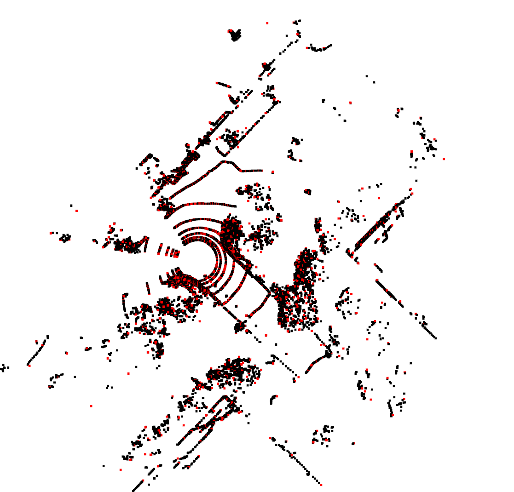
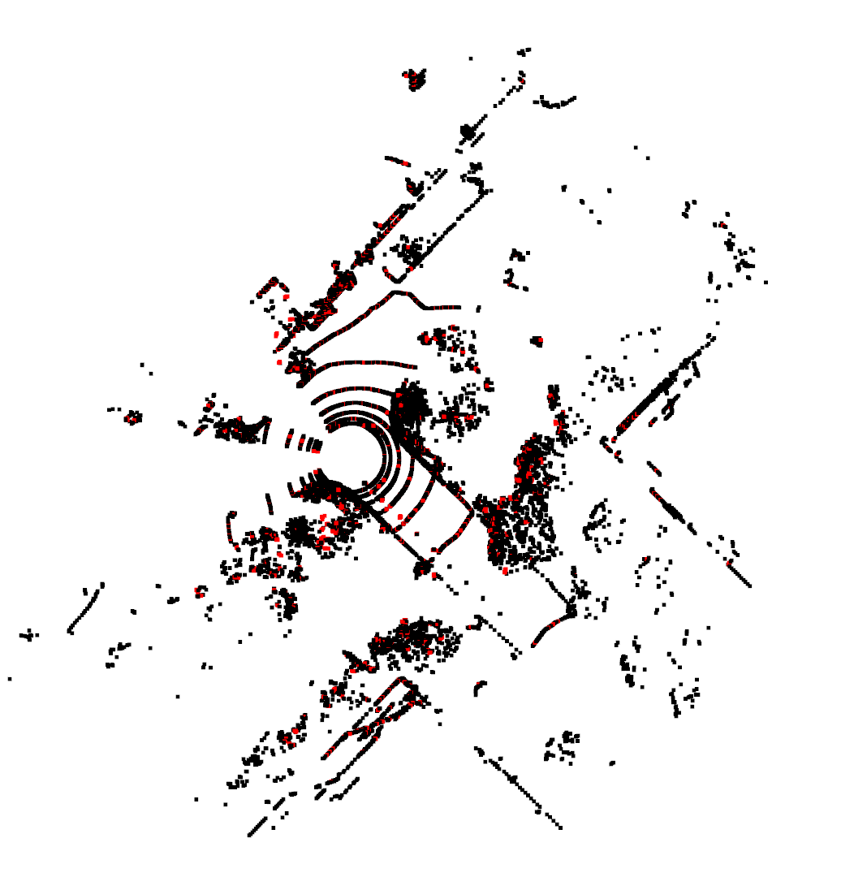
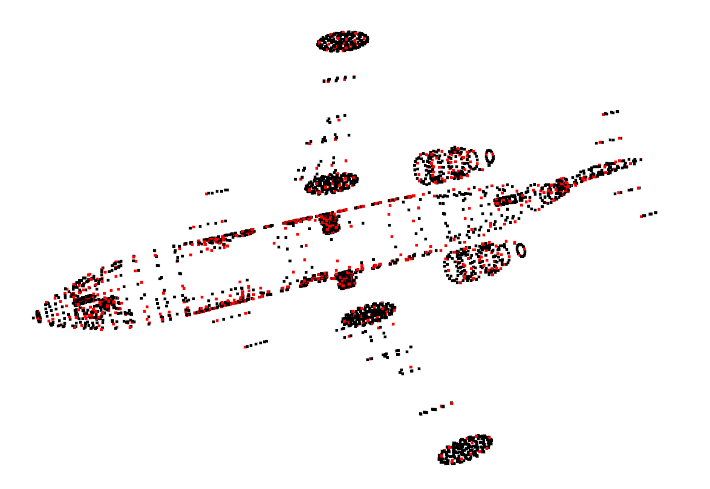
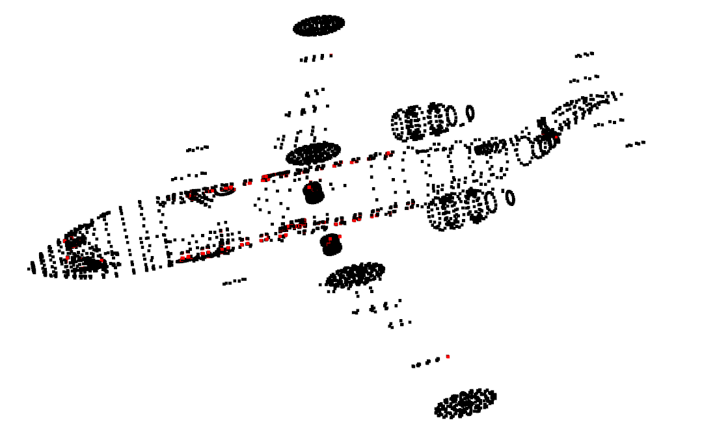

# 第七章 作业

## 解答

由于ISS算法本身原理比较容易，所以并没有在iss的实现中花费太多时间，只是大致实现了一个简单的版本，目的是为了理解iss的原理。由于没有对代码进行细致的实现，所以其效率较低。

iss特征提取的代码在模块`iss.py`中。`utility.py`模块用来对`off`格式的点云进行读取和可视化。

__my iss__

__open3d ISS__

__时间：__

my time cost： 5.28 s
o3d time cost： 0.0408s

__my iss__

__open3d iss__

## 总结

iss算法对于点云特征的提取，十分依赖于参数，不同的参数其最终得到的特征点数量和种类都大不相同。