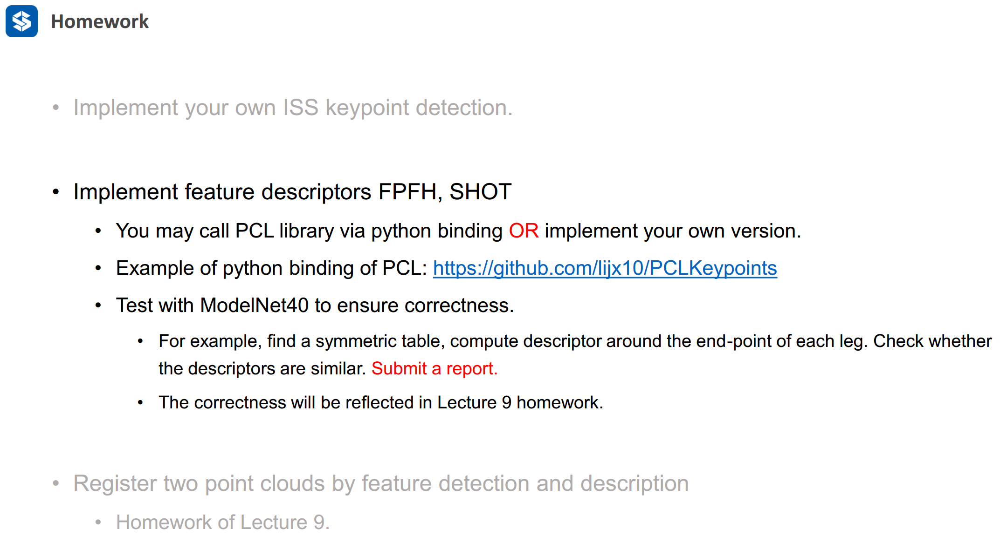
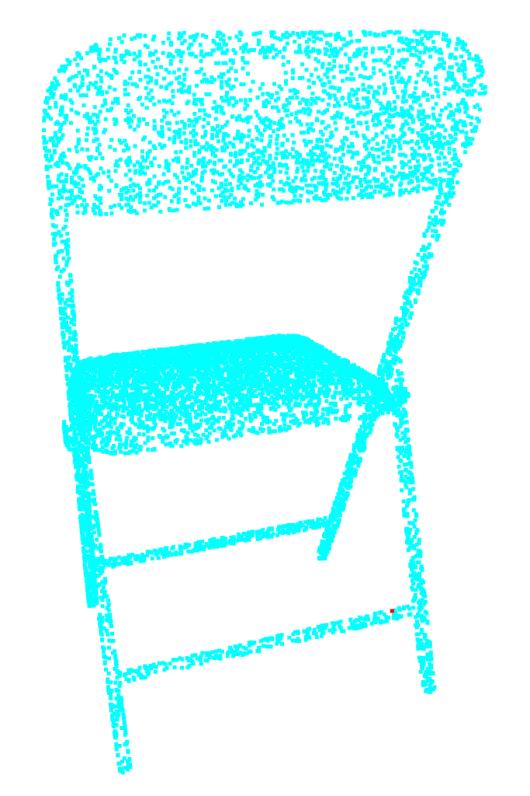
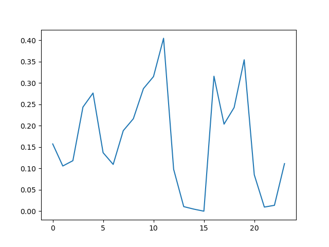
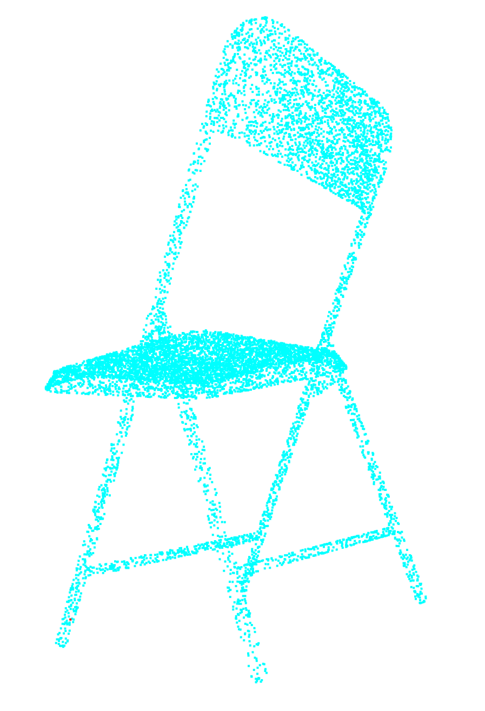
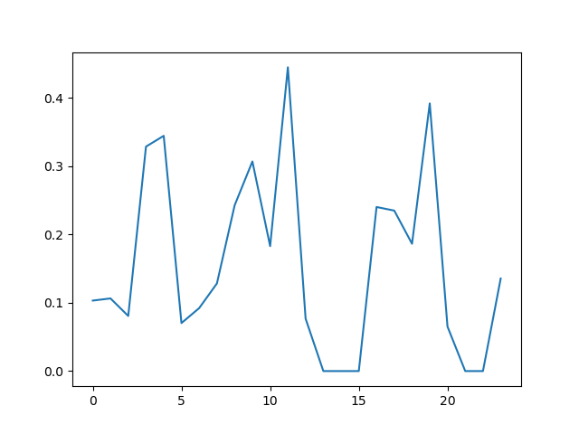
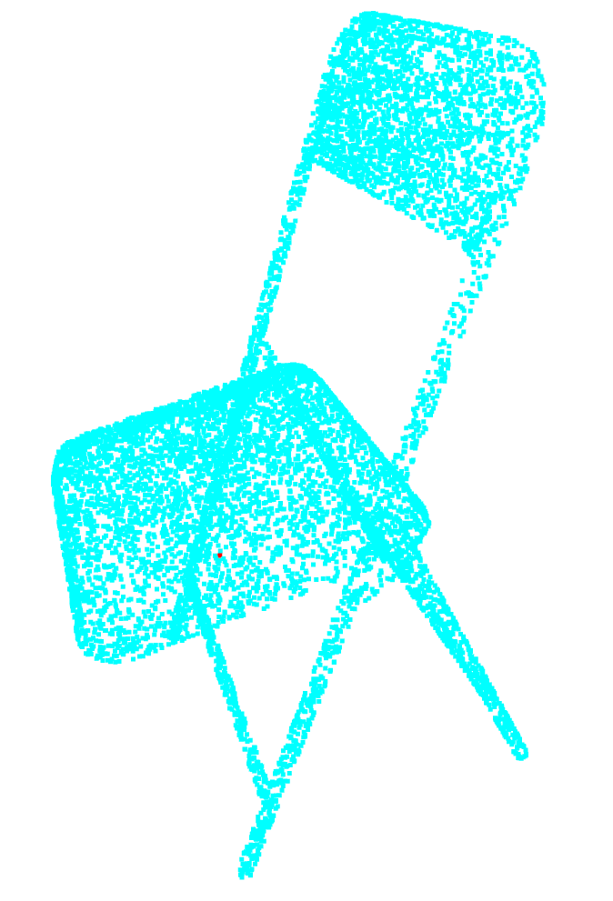
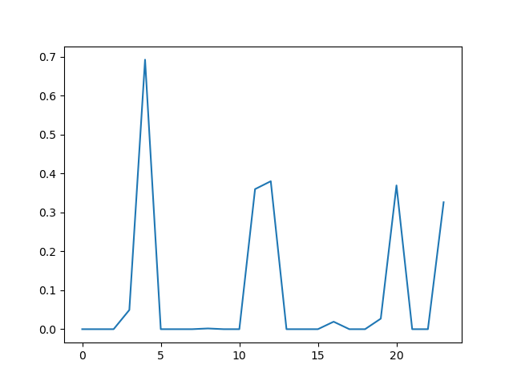
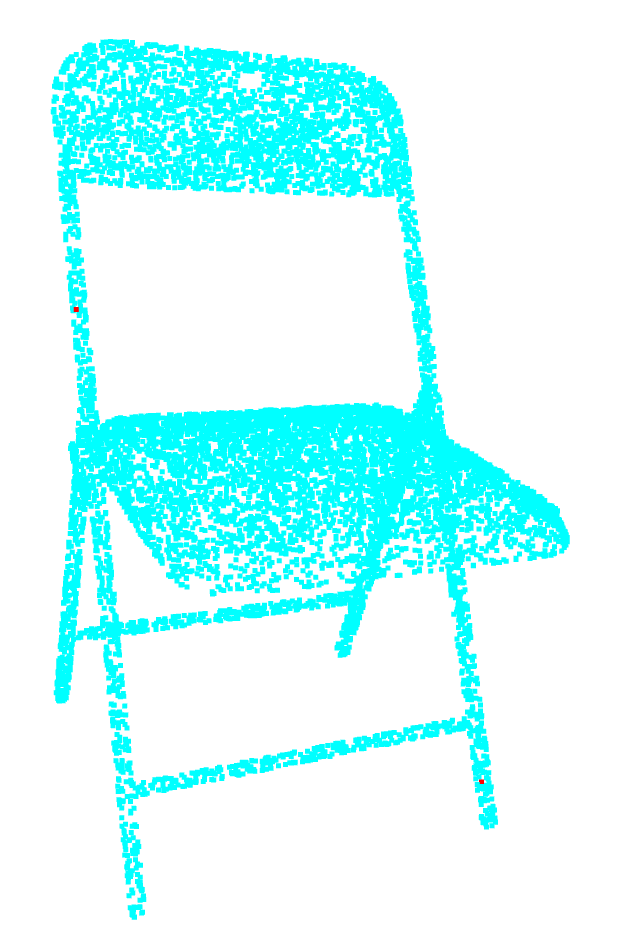
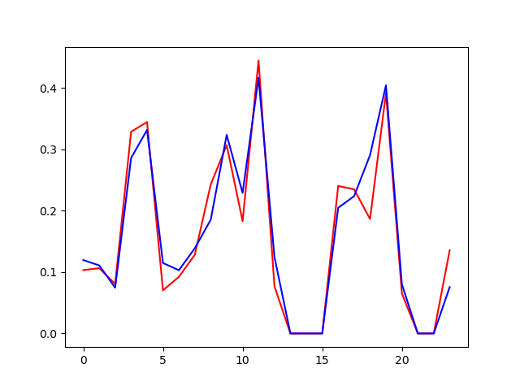

# 第八章 作业



## 1. FPFH

```python
def compute_SPFH(pointcloud, tree, point_index, radius, B):
    """
    Using Simplified Point Feature Histogram(SPFH)
    :param pointcloud: numpy.darray
        input point cloud
    :param tree: Open3d.geometry.KDTreeFlann
        point cloud search tree
    :param point_index: int
        keypoint index
    :param radius: float
        nearest neighborhood radius
    :param B: float
        number of bins for each dimension
    :return:
    """
    alpha, phi, theta = [], [], []
    point = pointcloud[point_index][0:3]
    nei_labels = tree.search_radius_vector_3d(point[0:3], radius)[1]
    nei_labels = np.asarray(list(set(nei_labels) - {point_index}))
    local_points = pointcloud[nei_labels]

    u = pointcloud[point_index][3:]
    p1 = pointcloud[point_index][0:3]

    for neighbor in local_points:
        p2 = neighbor[0:3]
        p2_p1_normal = (p2 - p1) / np.linalg.norm(p2 - p1, ord=2)
        v = np.cross(u, p2_p1_normal)
        w = np.cross(u, v)
        alpha.append(np.dot(v, neighbor[3:]))
        phi.append(np.dot(u, p2_p1_normal))
        theta.append(np.arctan2(np.dot(w, neighbor[3:]), np.dot(u, neighbor[3:])))

    alpha_histogram = np.histogram(alpha, B, range=(-1.0, 1.0))[0]
    alpha_histogram = alpha_histogram / alpha_histogram.sum()
    phi_histogram = np.histogram(phi, B, range=(-1.0, 1.0))[0]
    phi_histogram = phi_histogram / phi_histogram.sum()
    theta_histogram = np.histogram(theta, B, range=(-np.pi, np.pi))[0]
    theta_histogram = theta_histogram / theta_histogram.sum()
    signature = np.hstack(
        (
            alpha_histogram,
            phi_histogram,
            theta_histogram
        )
    )

    return signature


def compute_FPFH(pointcloud, tree, point_index, radius, B):
    """
    Compute Fast Point Feature Histogram(FPFH)
    :param pointcloud: numpy.darray
        input point cloud
    :param tree: Open3d.geometry.KDTreeFlann
        point cloud search tree
    :param point_index: int
        keypoint index
    :param radius: float
        nearest neighborhood radius
    :param B: float
        number of bins for each dimension
    :return:
    """
    point = pointcloud[point_index][0:3]
    nei_labels = tree.search_radius_vector_3d(point[0:3].reshape(3, 1), radius)[1]
    nei_labels = nei_labels[1:]

    w = 1.0 / np.linalg.norm(pointcloud[nei_labels, 0:3] - point, ord=2, axis=1)
    X = np.asarray(
        [compute_SPFH(pointcloud, tree, i, radius, B) for i in nei_labels]
    )
    spfh_nei = 1.0 / (len(nei_labels)) * np.dot(w, X)
    spfh_query = compute_SPFH(pointcloud, tree, point_index, radius, B)

    spfh = spfh_nei + spfh_query
    spfh = spfh / np.linalg.norm(spfh)

    return spfh
```

__算法思路：__

- step1 寻找关键点附近的邻居点；
- step2 将邻居点和关键点一一组合，计算$[\alpha, \phi, \theta]$；
- step3 对所有$[\alpha, \phi, \theta]$计算统计直方，然后将三个统计直方按照顺序组成一个向量；
- step4 遍历每一个邻居点，找到它对应的邻居点，然后计算$[\alpha, \phi, \theta]$，并计算统计直方，然后组成向量；
- step5  将所有统计直方组成的向量相加，获得最终的一个向量，并对这个向量进行归一化，即为当前关键点的描述子。

__实验结果：__

|                            关键点                            |                    FPFH描述子统计直方图                     |
| :----------------------------------------------------------: | :---------------------------------------------------------: |
|    |              |
|  |   |
|  |  |
|  |           |


> 注：由于open3d似乎不支持设置点云大小，所以上图很难看到关键点的位置！
>
> 第一张图：关键点在右腿和横档的交界处
>
> 第二张图：关键点在左腿地面处
>
> 第三张图：关键点在椅子的坐板偏右处
>
> 第四张图：关键点在椅子的左侧支架的中部和右腿的地面处

__实验结论：__

- 关键点的描述子在平面处具有比较相似的统计分布结果！

- 通过上述的第四张图可以看出来，具有相似特征的关键点，它们具有极其相似的统计分布结果！
- 通过将点云进行任意的旋转，发现同一个关键点，最终得到的描述子是一样的，说明FPFH对于旋转具有不变性。

__代码运行：__

```python
python3 FPFH.py
```

## TODO: 实现SHOT，并对比对比SHOT和FPFH

