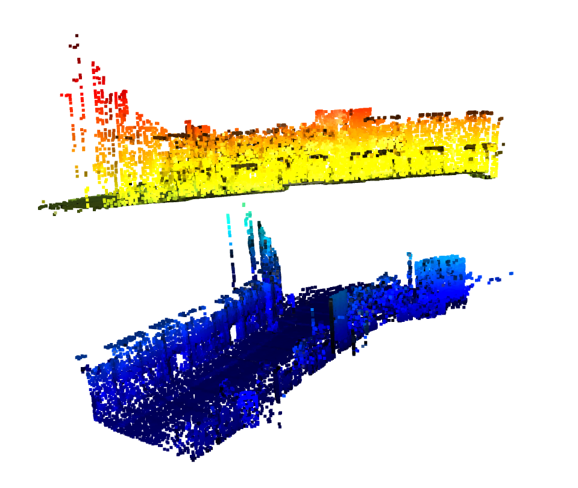
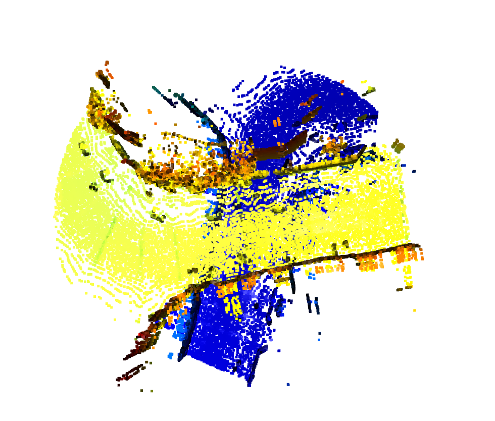
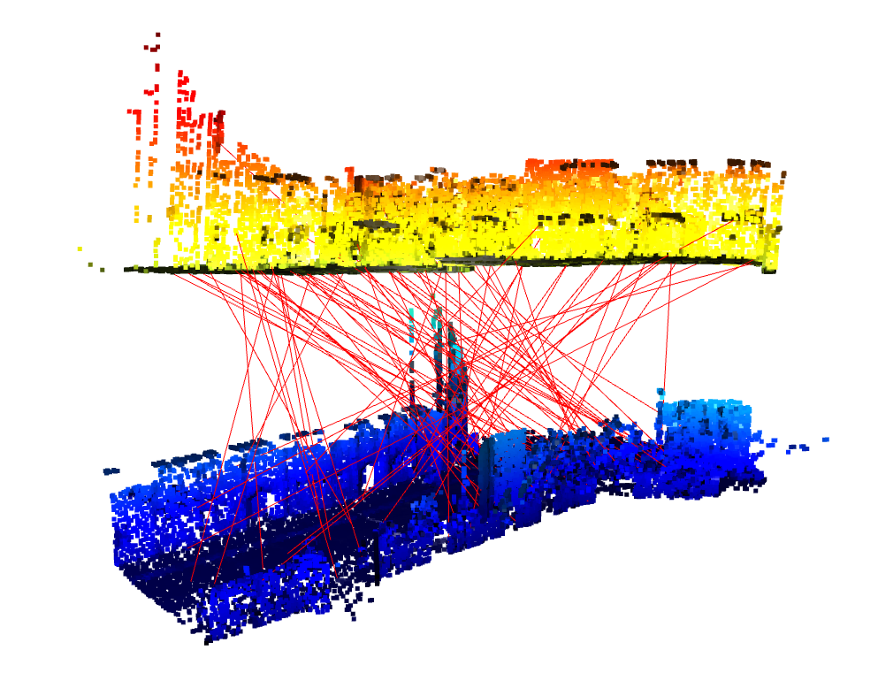
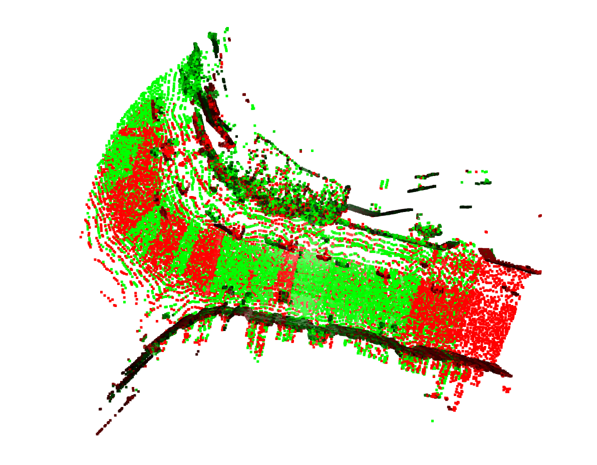

# 无初值的点云匹配pipeline

## 1. 算法流程

- 提取ISS特征点
- 计算FPFH描述子
- 进行描述子匹配。进行双向匹配，一个两个描述子相互匹配之后都是最近邻时，才认定为一次正确的匹配。
- 然后通过ransac icp，迭代计算`R`和`t`，找到inliers数量最多的那个`R`和`t`
- 以上一步的`R`和`t`为初值，执行精细的icp匹配。

__ICP的计算方法如下：__


## 2. 算法主要代码

```python
if __name__ == '__main__':
    arguments = get_arguments()

    # read target pointcloud
    pointcloud_numpy_target = utility.read_oxford_bin(arguments.file_path[0])
    pointcloud_o3d_target = o3d.geometry.PointCloud()
    pointcloud_o3d_target.points = o3d.utility.Vector3dVector(pointcloud_numpy_target[:, 0:3])
    pointcloud_o3d_target.normals = o3d.utility.Vector3dVector(pointcloud_numpy_target[:, 3:6])
    # pointcloud_o3d_target, _ = pointcloud_o3d_target.remove_radius_outlier(nb_points=4, radius=0.5)
    # compute target keypoints and descriptors
    keypoints_target = detector.detect_ISS(pointcloud_o3d_target)
    descriptor_target = descriptor.compute_fpfh(keypoints_target)

    # read source pointcloud
    pointcloud_numpy_source = utility.read_oxford_bin(arguments.file_path[1])
    pointcloud_o3d_source = o3d.geometry.PointCloud()
    # To facilitate observation, move the point cloud upward by 20 meters
    pointcloud_o3d_source.points = o3d.utility.Vector3dVector(pointcloud_numpy_source[:, 0:3] + np.array([0, 0, 20]))
    pointcloud_o3d_source.normals = o3d.utility.Vector3dVector(pointcloud_numpy_source[:, 3:6])
    # pointcloud_o3d_source, _ = pointcloud_o3d_source.remove_radius_outlier(nb_points=4, radius=0.5)
    # compute source keypoints and descriptors
    keypoints_source = detector.detect_ISS(pointcloud_o3d_source)
    descriptor_source = descriptor.compute_fpfh(keypoints_source)

    # get the matching relationship through the nearest neighbor search of the descriptor
    matches = get_matches(descriptor_target, descriptor_source)
    T, score = ransac_registration(keypoints_target, keypoints_source, matches, arguments.iterations, 2.0)
    print("\nThe number of descriptor matches", len(matches))
    print(" score: ", score)
    print("\n rough T (Only RANSAC): \n", T)

    # display original pointcloud
    o3d.visualization.draw_geometries([pointcloud_o3d_target, pointcloud_o3d_source], 'original')

    # display registration result 
    # To facilitate observation, move the point cloud upward by 20 meters
    keypoints_source.paint_uniform_color([0, 1, 0])
    keypoints_target.paint_uniform_color([1, 0, 0])
    utility.display_registration_result(
        keypoints_source=keypoints_source,
        keypoints_target=keypoints_target,
        matches=matches,
        pointcloud_source=pointcloud_o3d_source,
        pointcloud_target=pointcloud_o3d_target
    )

    # Use the RANSAC method to obtain the matching result as the initial value,
    # and perform fine icp matching
    icp = o3d.pipelines.registration.registration_icp(
        pointcloud_o3d_target, pointcloud_o3d_source, 1.0, T
    )
    print("\n fine ICP result:\n", icp.transformation)

    # transform source pointcloud by T.inv
    transformed_pointcloud_source = pointcloud_o3d_source.transform(np.linalg.inv(icp.transformation))

    # set color
    transformed_pointcloud_source.paint_uniform_color([0, 1, 0])
    pointcloud_o3d_target.paint_uniform_color([1, 0, 0])

    # display fine icp matched result
    o3d.visualization.draw_geometries([transformed_pointcloud_source, pointcloud_o3d_target], 'matched')
```

## 3. 代码运行方法

```shell
python3 registration.py -f data/0.bin data/456.bin -i 2000
```

> 完整的数据集
> 链接：https://pan.baidu.com/s/11OhSCA2Ck-WA6_b-iCNsfA 
> 提取码：hyi3

## 4.实验结果

原始点云如下：

|  |  |
| --------------------------------------------- | ------------------------------------------------------------ |

通过描述子搜索匹配的结果如下：



通过RANSAC得到的初值，执行进一步的精细ICP匹配，结果如下：



匹配得到的数据如下：

> The number of descriptor matches 88
>  score:  0.9004424778761062
>
>  rough T (Only RANSAC): 
>  [[-0.40565558 -0.91312647  0.04054144  1.50856521]
>  [ 0.91323544 -0.40675022 -0.02356449 -1.42916471]
>  [ 0.0380076   0.02746482  0.99889995 20.23287908]
>  [ 0.          0.          0.          1.        ]]
>
>  fine ICP result:
>  [[-4.10785228e-01 -9.11725047e-01 -3.59652727e-03  1.96688081e+00]
>  [ 9.11668421e-01 -4.10706686e-01 -1.34427419e-02 -3.98532711e-01]
>  [ 1.07789667e-02 -8.80092012e-03  9.99903174e-01  2.00889679e+01]
>  [ 0.00000000e+00  0.00000000e+00  0.00000000e+00  1.00000000e+00]]

## 5.结论

通过特征点匹配获得初值，然后将初值带入ICP算法执行迭代，获得更加精准的匹配结果。经过测试该方案非常有效，能解决大范围点云匹配问题。例如在SLAM中，较大轨迹误差之下的回环检测，可以使用这种思路。

该方案的缺点是，需要做较大数量的RANSAC迭代，会消耗大量的时间，不利于实时系统的里程计推算。